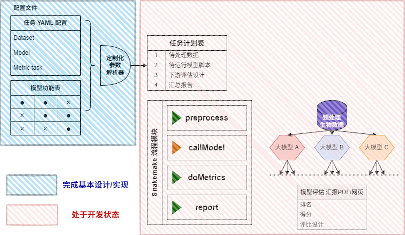
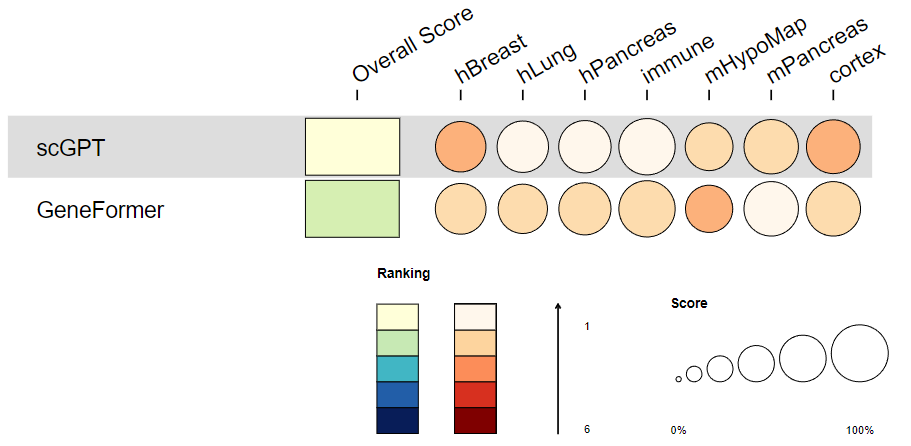
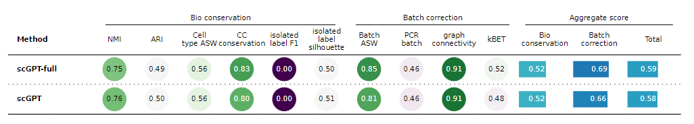

## scModelMetrics

用于生物单细胞大模型 下游任务评估

> 流程图

> 报告生成测试

报告生成目前使用原始脚本绘制，仍未完成封装，对GeneFormer和scGPT大模型生成示例如下：

### 开发规划

> __×__: 未开始开发

> __-__：原始脚本已开发，未封装 / 研发中

> __√__：已开发并封装使用

| 模块 | 功能 | 完成情况 |
| ---- | ---- | ---- |
| __预处理__ |  | - |
| | Gex模态预处理 | √ |
| | ATAC模态预处理 | - |
| __模型调度__ |  | - |
| | GeneFormer 注释 | √ |
| | GeneFormer 去批次效应 | √ |
| | scGPT 注释 | √ |
| | scGPT 去批次效应 | √ |
| | scGPT 基因扰动 | - |
| | GeneCompass 注释 | - |
| | State | - |
| | _其他模型_ | × |
| __指标评估__ |  | - |
| | [注释] ACC 准确度 | √ |
| | [注释] F1 分类系数 | √ |
| | [重构] Pearson 相关系数 | √ |
| | [重构] MSE | √ |
| | [整合/去批次] kBET | √ |
| | [整合/去批次] Graph connectivity | √ |
| | [整合/去批次] ARI | √ |
| | [整合/去批次] NMI | √ |
| | [整合/去批次] ASW | √ |
| | [整合/去批次] ARI | √ |
| | [整合/去批次] NMI | √ |
| | [整合/去批次] HVG conservation | - |
| | [整合/去批次] Graph cLISI | - |
| | _其他指标_ | × |

### 近期规划

- [x] 测试流程 环境搭建 脚本封装
- [x] GeneCompass 环境搭建 脚本封装
- [ ] 预处理进一步对齐 train / test 集数据的 annoKey 和 integKey, 进行规范化优化
- [ ] GeneCompass 注释、扰动代码封装
- [ ] Geneformer 注释 + 整合 联合调度的(其官方执行代码存在处理重合) 流程化封装，优化脚本执行效率
- [ ] 增添h5ad -> huggingface Transformer输入dataset类型的转接脚本，便于Geneformer、GeneCompass等HF系模型使用
- [ ] HVG conservation, Graph cLISI 指标封装测试
- [ ] scGPT 基因扰动 脚本封装
- [ ] State 等大模型 原始脚本开发
- [ ] 优化任务调度 代码逻辑